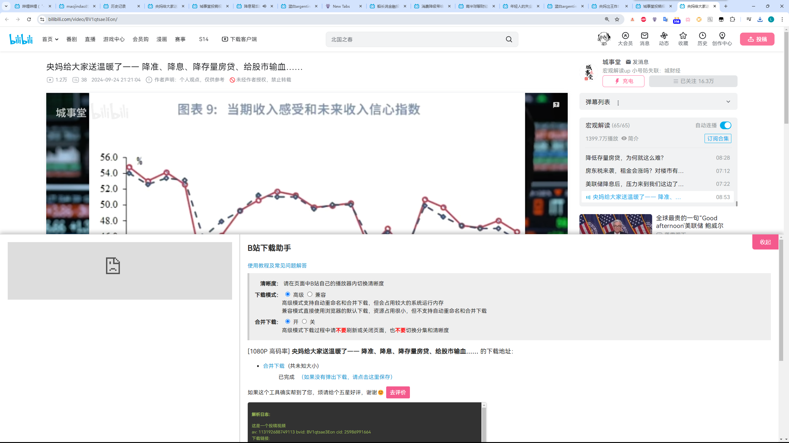

# WhipserSchedulerProject

## 环境搭建
* python
* ffmpeg+whisper
https://www.kocpc.com.tw/archives/520051

### Demo
```shell
ffmpeg -i sample.mp4 -ss 00:00:00 -t 00:00:59 sample.mp3
whisper --model base --language Chinese sample.mp3

```

### picture
下载使用的插件

